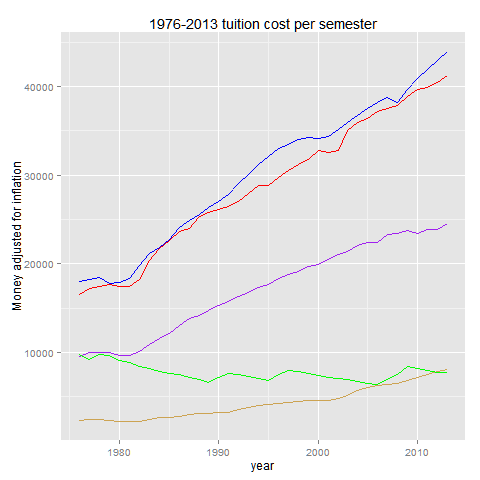
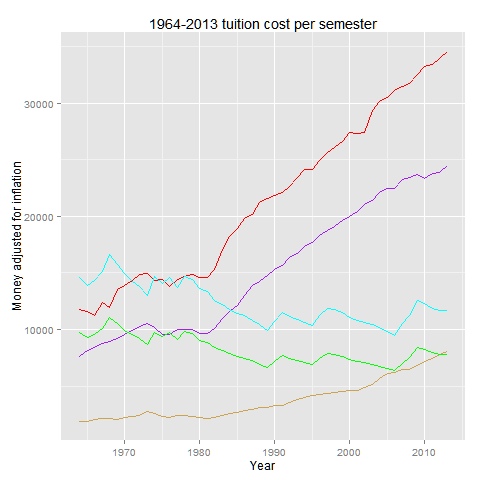
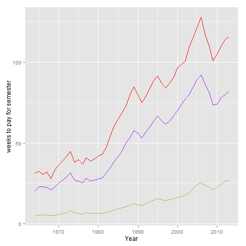
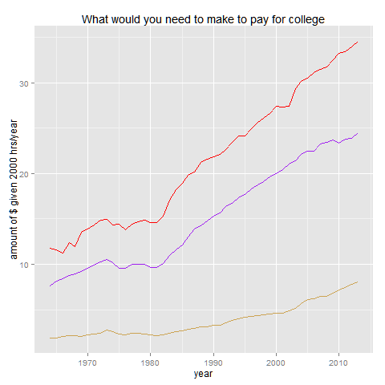
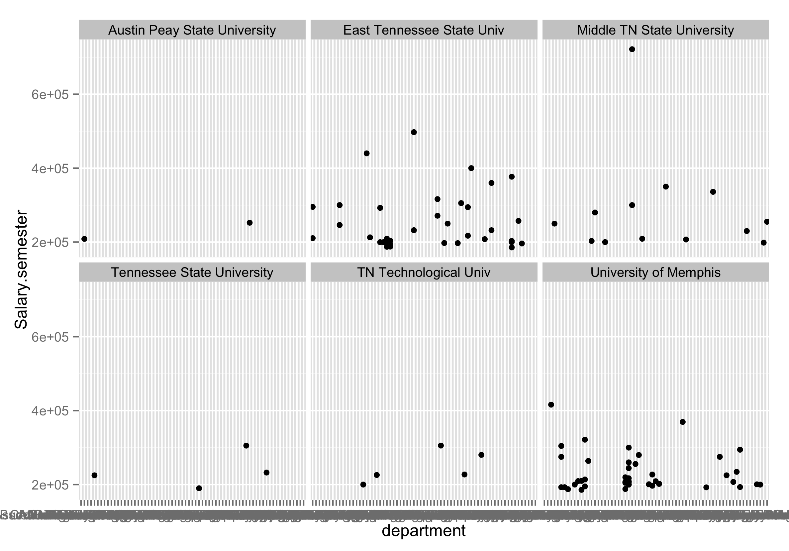

# CollegeGraphs
From Undergrad I found it interesting to see 
1. What historical college tuition looked like versus what median wages looked like
2. What wages looked like accross different departments across different schools

As of 2013 when this was orignally written open source resources of tuition prices weren't easily accessible, could only find yale and Harvard, there were more options for finding tuition costs post 1990, but trying to finding historical pricing to prove rates were getting worse is harder

### First Graph

From top to bottom (prices adjusted for inflation):
Yale : Blue
Harvard : Red
Surveryed Private Colleges : purple
Minimum Wage (40 hours a week) : green
Surveyed Public Colleges: yellow

While overall the minimum wage costs are roughly stable, the costs of colleges across the board have increased dramatically.

### Second Graph

From top to bottom (prices adjusted for inflation):
Harvard : Red
Surveryed Private Colleges : purple
Minimum Wage (40 hours a week) : green
Minimum Wage (60 hours a week) : green
Surveyed Public Colleges: yellow

I could find data dating back further for Harvard and general college tuitions, and I wanted to see if someone working 40 hours a week on minimum wage could afford a private college, and also a bit overboard and unrealistic of working 60 hours a week. 
This is ignoring boarding costs and food and utilities, and possible scholarships, but just based on a starter job alone.

### Extra Graphs

To really hammer the point home, I wanted to know, given the minimum wage, how much you would have to work in order to pay for college.

## Tennessee Board of Regants Salary graphs

I seem to have lost some of the cleaned data, but was trying to determine by department how much on average each employee was making. However the data is inconsistent from school to school.

##### References #####
for electricity prices
http://www.eia.gov/totalenergy/data/annual/showtext.cfm?t=ptb0810
for gas prices, for more recent price, google keeps track of it
http://www.davemanuel.com/2010/12/30/historical-gas-prices-in-the-united-states/
general tuition prices
https://nces.ed.gov/programs/digest/d13/tables/dt13_330.10.asp
couldn't find a table that represented it, so manually inputted $1 in one slot and found the correlation
http://www.usinflationcalculator.com/
finding 1996-2013 Yale tuition costs
http://oir.yale.edu/yale-factsheet
finding 1964-2013 scaled to 2007 tution costs for Harvard
http://kwharbaugh.blogspot.com/2005/02/educational-costs.html

